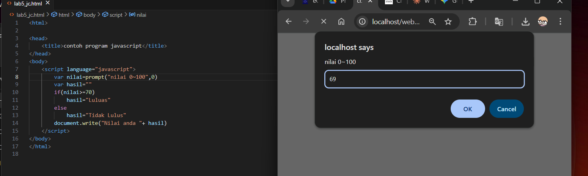

# Latihan Javascript


Halo halo, ini adalah lanjutan dari [Html dasar](https://github.com/laLafid/Lab1Web), [CSS dasar](https://github.com/laLafid/lab2web), [CSS](https://github.com/laLafid/Lab3Web) dan [CSS Layout](https://github.com/laLafid/Lab4Web)
Sekarang disini akan mempelajari Javascript.

## Langkah-langkah

1. **Siapkan Editor**
    - Misal Visual Studio Code.
    

2. **Buat kerangka baru**
    - Buat file baru `lab5_jc.html` dan masukkan struktur HTML dasar:
    

3. **Berbagai Javacript**

    - Alert
    

    - Method di objek
    

    - Prompt
    

    - Function
    

    - Aritmatika 
    

    - Kondisi If-elsse
    

    - Operator Switch
    

    - Form input
    

    - Form Button
    

    - Checkbok 
    

    
## Contoh Akhir

'file lab5_jc.html
```html
<!DOCTYPE html>
<html lang="en">

<head>
    <title>Mengenal JavaScript</title>
</head>

<body>
    <h1>Pengenalan JavaScript</h1>
    <h3>Contoh document.write dan console.log</h3>
    <script>
        document.write("Hello World");
        console.log("Hello World");
    </script>
</body>

</html>
```

'file lab5_jc.html * checkbo
```html
<html>

<head>
    <title>Daftar Menu</title>
    <script>
        function hitung(ele) {
            var total = document.getElementById('total').value;
            total = (total ? parseInt(total) : 0);
            var harga = 0;

            if (ele.checked) {
                harga = ele.value;
                total += parseInt(harga);
            }
            else {
                harga = ele.value;
                if (total > 0)
                    total -= parseInt(harga);
            }

            document.getElementById('total').value = total;
        }
    </script>
</head>

<body>
    <h1>Daftar Menu Makanan</h1>
    <label><input type="checkbox" value="5000" id="menu1" onclick="hitung(this);"> Ayam Goreng Rp. 5.000</label><br>
    <label><input type="checkbox" value="500" id="menu2" onclick="hitung(this);"> Tempe Goreng Rp. 500</label><br>
    <label><input type="checkbox" value="2500" id="menu3" onclick="hitung(this);"> Telur Dadar Rp. 2.500</label><br>
    <strong>Total Bayar: Rp. <input id="total" type="text" readonly></strong>
</body>

</html>
```

---
*Selamat mencoba*
